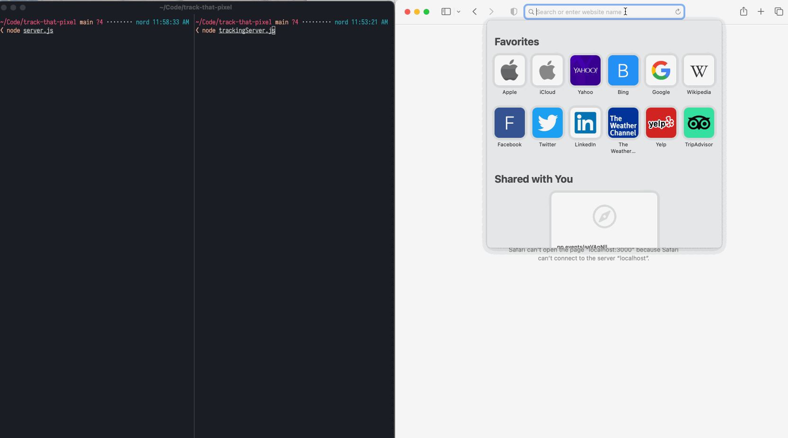

# Track that pixel



## Background

[A tracking pixel](https://en.wikipedia.org/wiki/Web_beacon) (also known as “web beacon”) is a visually-unnoticeable bit of information included in an HTML document that, when loaded by a client, will send information to a third-party server. This HTML could hypothetically appear anywhere on the web, but the most common format is as a webpage or email document. The most common example is the [Meta Pixel](https://www.facebook.com/business/tools/meta-pixel/) ([developer docs](https://developers.facebook.com/docs/meta-pixel)): a small piece of code that any website owner can utilize to track user data and improve their targeted advertising.

Researches at the Markup and Adalytics have reported on several furtive — and possibly illegal — uses of the tracking pixel in the domains of [tax preparation software](https://themarkup.org/pixel-hunt/2022/11/22/tax-filing-websites-have-been-sending-users-financial-information-to-facebook), [medical care](https://themarkup.org/pixel-hunt/2022/06/16/facebook-is-receiving-sensitive-medical-information-from-hospital-websites), and [U.S. politicians’ personal websites](https://adalytics.io/blog/is-congress-leaking-your-data). Unlike many industries, tax, medicine, and politics are highly-regulated, with existing laws on the books specifically to protect privacy. (In fact, Senators Warren, Wyden, and others [recently recommended](https://www.warren.senate.gov/oversight/reports/in-new-report-senators-warren-wyden-lawmakers-reveal-massive-likely-illegal-breach-of-taxpayer-privacy-by-tax-prep-companies-with-meta_call-for-agencies-to-investigate-prosecute) that several federal agencies, including the Dept. of Justice, investigate these privacy violations and prosecute any company that violated the law.)

## Objective

Implement a minimally-viable tracking pixel to illustrate the ease with which sites can compromise user privacy (intentionally **_and_** unintentionally).

In general, consumers ought to be aware of this basic tracking technology and how it negatively impacts their overall privacy across the web. And developers ought to exercise judgement — and abide by the law, depending on the industry — when incorporating this tracking on websites they build.

## Experiment design

To simulate the behavior of a tracking pixel, we’re going to build a minimal client-server interaction with a third-party tracking server. The experiment will proceed roughly as follows:

1. The client (the browser) will load a page of HTML from the server with a basic GET request.
2. The server will include an “undetectable” `` tag that loads an image from a third-party server.
3. When the client receives a response from the server, it will load the HTML.
   1. When loading the `` tag in particular, the URL will be dynamically constructed such that it passes along several arguments containing user data. When reading the tag, the browser will reach out to the third-party server to download the image located at the provided URL.
   2. The third-party server will receive the image request and log the response — replete with the data harvested from the user. In practice, this data would be persisted in a database or other service for future analysis.
   3. The third-party server will respond with some legitimate image — in our case, a single pixel — for which the browser can “display” (keep in mind that the tag is so small that the user won’t even see it).
4. The user proceeds to interact with the webpage, never suspecting that their data has just been harvested.

## Running the experiment

_Prerequisite: ensure that you have [Node.js
installed](https://nodejs.org/en)._

Clone this repository.

```
git clone https://github.com/dylanirlbeck/track-that-pixel.git
```

Navigate to the cloned repository. In your [shell](<https://en.wikipedia.org/wiki/Shell_(computing)>), run

```
node server.js
```

In a separate shell, run

```
node trackingServer.js
```

In your browser of choice, navigate to `http://localhost:3000`. From here, you
can play around with the provied input, inspect the source using the browser's
developer tools panel, check the output logs from each server, etc.

## Tech stack

- Client: Google Chrome browser loading a basic HTML file from disk. The file
  has a few lines of JavaScript to dynamically construct the tracking server URL
  with an `email` argument.
- Server: Content server running locally on port 3000, [Node.js](https://nodejs.org/en) runtime.
- Tracking server: Running locally on port 8000, Node.js runtime.

```

```
